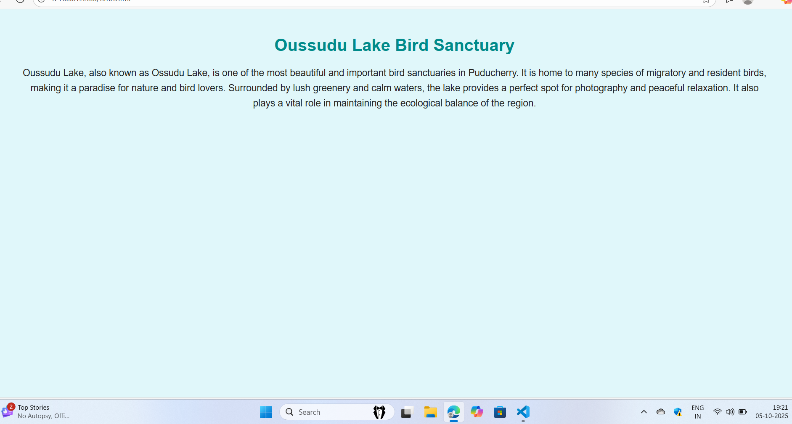
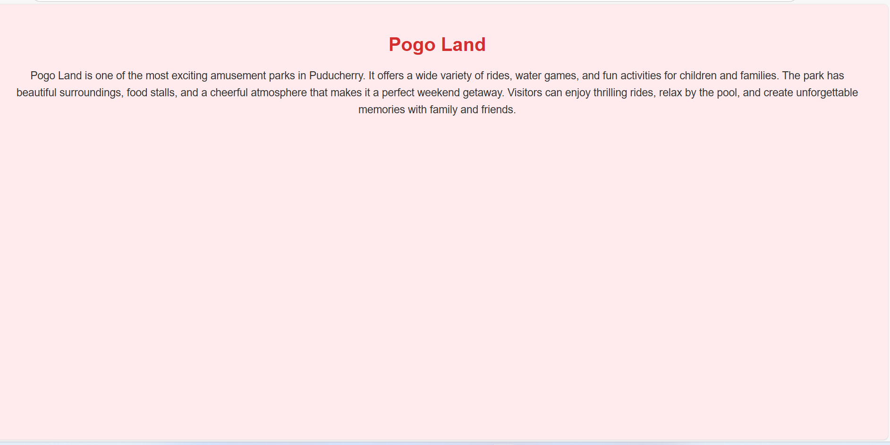

# Ex04 Places Around Me
## Date: 

## AIM
To develop a website to display details about the places around my house.

## DESIGN STEPS

### STEP 1
Create a Django admin interface.

### STEP 2
Download your city map from Google.

### STEP 3
Using ```<map>``` tag name the map.

### STEP 4
Create clickable regions in the image using ```<area>``` tag.

### STEP 5
Write HTML programs for all the regions identified.

### STEP 6
Execute the programs and publish them.

## CODE
```map
html>
<head>
    <title>My City</title>
    <style>
        body {
            font-family: Arial, sans-serif;
            background-color: #f9f9f9;
            text-align: center;
            margin: 0;
            padding: 0;
        }

        h1 {
            color: red;
            margin-top: 20px;
        }

        h3 {
            color: blue;
            margin-bottom: 20px;
        }

        img {
            border: 3px solid #333;
            border-radius: 8px;
            margin-top: 20px;
        }

        area {
            cursor: pointer;
        }
    </style>
</head>
<body>
    <h1><b>pondicherry</b></h1>

    

    <map name="MyCity">
        <!-- 5 clickable rectangular areas -->
        <area shape="rect" coords="620,420,720,480" href="home.html" title="My Home Town">
        <area shape="rect" coords="1100,120,1200,180" href="hospital.html" title="Famous hospital">
        <area shape="rect" coords="2000,100,1260,320" href="museum.html" title="City Museum">
        <area shape="rect" coords="700,100,500,500" href="pogoland.html" title="pogoland">
        <area shape="rect" coords="400,300,1000,600" href="lake and santuary.html" title="lake and santuctuary">
        
        
    </map></body>
</html>

home

!DOCTYPE html>
<html>
<head>
  <title>My Home Town</title>
  <style>
    body {
      background-color: lightblue;
      font-family: Arial, sans-serif;
      margin: 50px;
      text-align: center;
    }
    h1 {
      color: darkblue;
    }
    p {
      color: black;
      font-size: 18px;
      line-height: 1.6;
    }
  </style>
</head>
<body>
  <h1>My Home Town</h1>
  <p>
    My hometown is a peaceful and beautiful place. 
    It is known for its rich culture, friendly people, and natural beauty. 
    I love the calm environment, the fresh air, and the traditional festivals 
    that bring everyone together.
  </p>
</body>
</html>

hospital
 
 <!DOCTYPE html>
<html>
<head>
  <title>JIPMER Hospital</title>
  <style>
    body {
      background-color: #fff9c4; /* soft light yellow background */
      font-family: Arial, sans-serif;
      margin: 50px;
      text-align: center;
    }
    h1 {
      color: darkred;
    }
    p {
      color: #333;
      font-size: 18px;
      line-height: 1.6;
    }
  </style>
</head>
<body>
  <h1>JIPMER Hospital</h1>
  <p>
    Jawaharlal Institute of Postgraduate Medical Education and Research (JIPMER) 
    is one of India’s premier medical institutions, located in Puducherry. 
    It offers high-quality medical education, advanced research, and excellent 
    healthcare services to people from across the country. 
    JIPMER is well known for its modern facilities, specialized treatments, 
    and commitment to providing affordable healthcare for all. 
  </p>
</body>
</html>


lake

<!DOCTYPE html>
<html>
<head>
  <title>Oussudu Lake Bird Sanctuary</title>
  <style>
    body {
      background-color: #e0f7fa; /* light teal blue for a natural look */
      font-family: Arial, sans-serif;
      margin: 50px;
      text-align: center;
    }
    h1 {
      color: darkcyan;
    }
    p {
      color: #222;
      font-size: 18px;
      line-height: 1.6;
    }
  </style>
</head>
<body>
  <h1>Oussudu Lake Bird Sanctuary</h1>
  <p>
    Oussudu Lake, also known as Ossudu Lake, is one of the most beautiful 
    and important bird sanctuaries in Puducherry. 
    It is home to many species of migratory and resident birds, 
    making it a paradise for nature and bird lovers. 
    Surrounded by lush greenery and calm waters, 
    the lake provides a perfect spot for photography and peaceful relaxation. 
    It also plays a vital role in maintaining the ecological balance of the region.
  </p>
</body>
</html>


museum
<!DOCTYPE html>
<html>
<head>
  <title>Pondicherry Museum</title>
  <style>
    body {
      background-color: #fff5e6; /* soft peach background */
      font-family: Arial, sans-serif;
      margin: 50px;
      text-align: center;
    }
    h1 {
      color: darkgreen;
    }
    p {
      color: #333;
      font-size: 18px;
      line-height: 1.6;
    }
  </style>
</head>
<body>
  <h1>Pondicherry Museum</h1>
  <p>
    The Pondicherry Museum is one of the most famous attractions in Puducherry. 
    It showcases a rich collection of sculptures, archaeological finds, coins, 
    and artifacts from the Roman settlement of Arikamedu. 
    The museum also has galleries displaying French furniture, paintings, 
    and historic items that highlight the cultural heritage of Pondicherry. 
    It is a must-visit place for those who want to explore the history 
    and artistic legacy of the region.
  </p>
</body>
</html>


pogolang

<!DOCTYPE html>
<html>
<head>
  <title>Pogo Land</title>
  <style>
    body {
      background-color: #ffebee; /* light pink background for a fun look */
      font-family: Arial, sans-serif;
      margin: 50px;
      text-align: center;
    }
    h1 {
      color: #d32f2f; /* bright red heading */
    }
    p {
      color: #333;
      font-size: 18px;
      line-height: 1.6;
    }
  </style>
</head>
<body>
  <h1>Pogo Land</h1>
  <p>
    Pogo Land is one of the most exciting amusement parks in Puducherry. 
    It offers a wide variety of rides, water games, and fun activities 
    for children and families. The park has beautiful surroundings, 
    food stalls, and a cheerful atmosphere that makes it a perfect weekend getaway. 
    Visitors can enjoy thrilling rides, relax by the pool, and create 
    unforgettable memories with family and friends.
  </p>
</body>
</html>
```

## OUTPUT





## RESULT
The program for implementing image maps using HTML is executed successfully.
